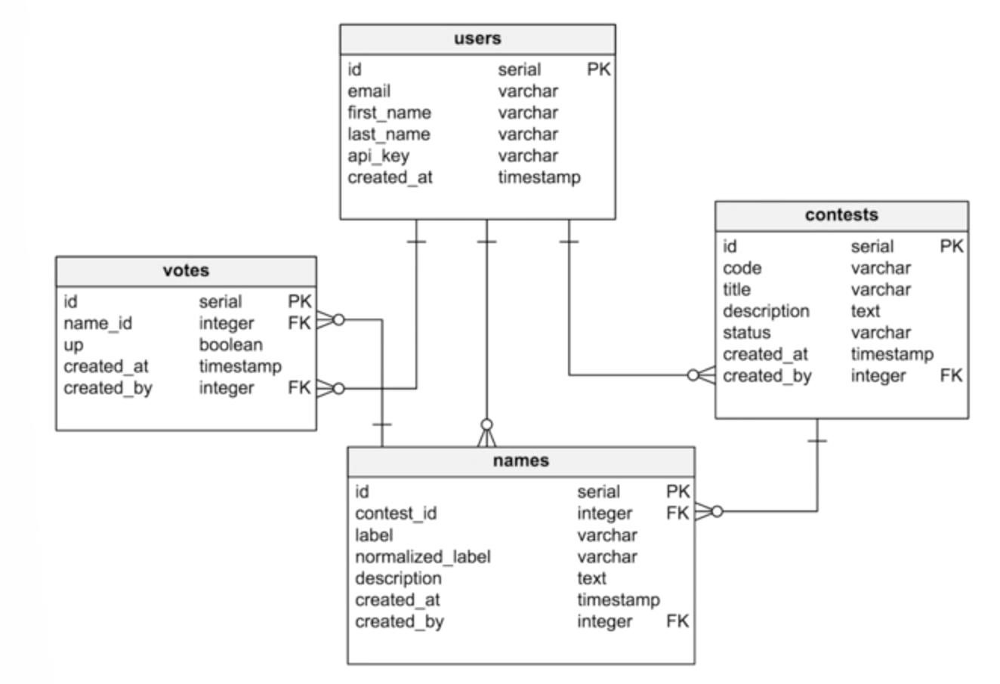

# Implementação de um servidor GraphQL

[Curso Pluralsight](https://app.pluralsight.com/player?course=graphql-scalable-apis)

---

## Requisitos

- Postgres rodando

- MongoDB rodando

- NodeJS

---

## Comandos

`npm run start_dbs`

`npm install`

`npm run dev`

Accessar `http://localhost:3000/graphql` playground do GraphiQL

---

## Principais dependências

### [graphQL-js](https://github.com/graphql/graphql-js)
Implementação do GraphQL em JS

### [express](https://expressjs.com/)
Servidor HTTP para nodeJS

### [express-graphql](https://github.com/graphql/express-graphql)
Facilita a criação e um servidor GraphQL com Express

### [humps](https://github.com/domchristie/humps)
Converte Underscore-to-camelCase

---

## Infraestrutura
GraphQL que se comunica com dois bancos diferentes para a entrega de dados ao cliente:

- MongoDB
- PostGreSQL

---

## Funcionamento da aplicação
É uma aplicação que tem o objetivo de criar nomes criativos para produtos genéricos.

### Postgres
#### Tabelas
- `contests`: São criados Contests para receber propostas de nomes para produtos
- `names`: Nomes criativos para os produtos genéricos listados em cada Contest
- `users`: Usuários que criam Contests, e votam em nomes que foram propostos
- `votes`: Quantidade de votos para cada nome criativo que foi proposto

#### Definição da Estrutura no Postgres (UML)

### Mongo
Coleção `Users` armazena detalhes de cada usuário:

- ID do usuário
- Quantidade de contests criados pelo usuário
- Quantidade de nomes que foram propostos
- Quantidade de votos totais em propostas de nomes para os produtos
